# 第一次作业
网络与信息安全
计算机2102 李芝塬 2216113163
为了更好的阅读体验，可以点击链接前往[Github](https://github.com/KnownCircle/Network-Security/blob/main/%E5%AE%9E%E9%AA%8C1/%E6%8A%A5%E5%91%8A.md)

## 实验原理
在访问网址时，需要向DNS服务器查询这个网址对应的ip地址

如果DNS服务器中没有缓存这个网址，则会向权威域名服务器查找这个网址对应的ip地址，并添加到缓存中；

如果已经缓存了这个网址，则直接从缓存中读取ip，并返回给客户端。

本次实验就是通过污染DNS服务端的缓存，让DNS服务端缓存错误的信息，从而给客户端返回错误的信息。

由于DNS服务端与权威域名服务器之间用UDP连接，数据包可以伪造。本实验就是通过伪造域名服务器与DNS服务器之间的UDP数据包向DNS服务器发送伪造的数据。

本次实验仅针对`*.example.com`，并指向`1.1.1.1`

通过不断地向DNS服务器发送大量伪造的数据包来欺骗DNS服务器，碰撞出合理的数据包，让其误以为数据来自权威域名服务器

由于部分网址已经在服务端中已经有缓存，并且缓存有一定时效性，在缓存一段时间之后就需要刷新，重新向域名服务器请求信息，因此需要发送大量包以提高被缓存的概率

## 实验步骤
### 前置实验
#### 实验环境
自己搭建的虚拟机，操作系统为Ubuntu 22.04.3 LTS

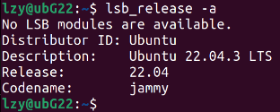

ip地址为`192.168.47.131`

#### 步骤
1. 更改Hosts文件，安装apache2:
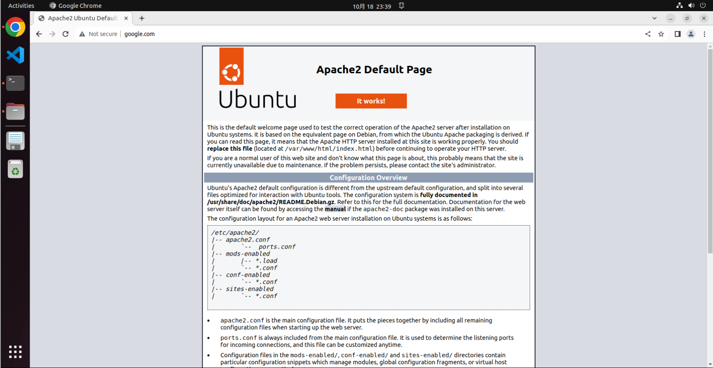
1. 使用dig工具查看网站域名解析过程：
   + 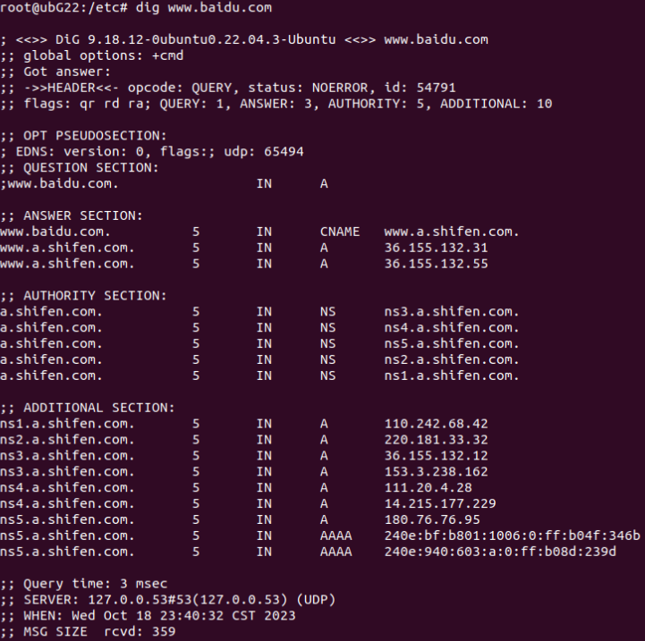
   + `; <<>> DiG 9.18.12-0ubuntu0.22.04.3-Ubuntu <<>> www.baidu.com`这表示你正在使用版本为 9.18.12-0ubuntu0.22.04.3-Ubuntu 的`dig`命令查询`www.baidu.com`。
   + `NOERROR`表示查询成功，没有错误。
   + `flags`下的`qr`表示这是一个查询响应`rd`表示递归查询，`ra`表示服务器支持递归。
   + `udp: 65494`指使用的UDP缓冲区大小为65494字节。
   + `www.baidu.com. IN A`表示正在查询`www.baidu.com`的A记录（IPv4地址）。
   + 在这次DNS查询中，`www.baidu.com`被解析为`www.a.shifen.com`的别名。
   + `;; AUTHORITY SECTION:`部分包含了授权信息，指示哪些DNS服务器有权提供这个域名的解析信息。
2. 使用`dig +trace`命令查询`www.bilibili.com`的完整解析过程：
   + 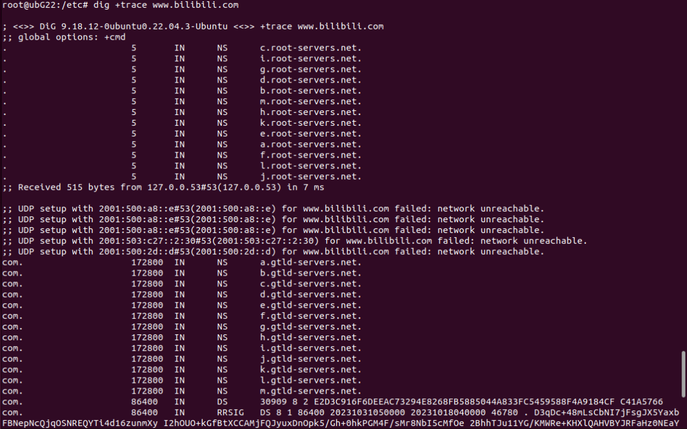
   + 首先，`dig`向根域名服务器查询域名`www.bilibili.com`的IP地址，它从根域名服务器（`a.root-servers.net`等）开始查找
   + 在每一步中，`dig`查询了根域名服务器的NS记录，以确定下一个需要查询的域名服务器。每个查询都包括对IPv6地址的尝试，但由于“network unreachable”（网络不可达）错误，无法成功建立IPv6连接。
   + 查询`.com`服务器
   + 查询`bilibili.com`服务器
   + 最终，`dig`查询到了`bilibili.com`的权威域名服务器，它的NS记录指向了`ns3.dnsv5.com`和`ns4.dnsv5.com`。

### 使用`dig +trace`解析另一个域名
这是实验报告第2项要求

我们解析知乎(`zhihu.com`)，得到如下结果：
```shell
lzy@ubG22:~$ dig +trace zhihu.com

; <<>> DiG 9.18.12-0ubuntu0.22.04.3-Ubuntu <<>> +trace zhihu.com
;; global options: +cmd
.			5	IN	NS	g.root-servers.net.
.			5	IN	NS	j.root-servers.net.
.			5	IN	NS	m.root-servers.net.
.			5	IN	NS	e.root-servers.net.
.			5	IN	NS	f.root-servers.net.
.			5	IN	NS	b.root-servers.net.
.			5	IN	NS	d.root-servers.net.
.			5	IN	NS	c.root-servers.net.
.			5	IN	NS	k.root-servers.net.
.			5	IN	NS	h.root-servers.net.
.			5	IN	NS	l.root-servers.net.
.			5	IN	NS	a.root-servers.net.
.			5	IN	NS	i.root-servers.net.
;; Received 315 bytes from 127.0.0.53#53(127.0.0.53) in 4 ms

;; UDP setup with 2001:500:2::c#53(2001:500:2::c) for zhihu.com failed: network unreachable.
;; UDP setup with 2001:500:2::c#53(2001:500:2::c) for zhihu.com failed: network unreachable.
;; UDP setup with 2001:500:2::c#53(2001:500:2::c) for zhihu.com failed: network unreachable.
com.			172800	IN	NS	a.gtld-servers.net.
com.			172800	IN	NS	b.gtld-servers.net.
com.			172800	IN	NS	c.gtld-servers.net.
com.			172800	IN	NS	d.gtld-servers.net.
com.			172800	IN	NS	e.gtld-servers.net.
com.			172800	IN	NS	f.gtld-servers.net.
com.			172800	IN	NS	g.gtld-servers.net.
com.			172800	IN	NS	h.gtld-servers.net.
com.			172800	IN	NS	i.gtld-servers.net.
com.			172800	IN	NS	j.gtld-servers.net.
com.			172800	IN	NS	k.gtld-servers.net.
com.			172800	IN	NS	l.gtld-servers.net.
com.			172800	IN	NS	m.gtld-servers.net.
com.			86400	IN	DS	30909 8 2 E2D3C916F6DEEAC73294E8268FB5885044A833FC5459588F4A9184CF C41A5766
com.			86400	IN	RRSIG	DS 8 1 86400 20231031210000 20231018200000 46780 . aC9hmdv4at+onRi+SBhoK+bkZDaRN1Vcas543M2fBlZbi9HwlvGJTqNh ClIiKaae8bqy27vredUdHkz6iuExIOI8PMvIyOXgNQSkiYqt37WOCUGt ujjUADdZrw/u89tHtExDpew0QNS8P64UOHNo7+Tbya/lcjhnZeroDAtF +LyKClkk2jxu1zUrPrRyqodjCbOFO5KmEamMt2qFhyB8wiqTHqQy3kY0 ZuzFoIp6SQcst8CW/G0S6kcA7kElhoc8jRb3EM0AQyRbrilbHyA7BBT2 6Qu6R4H/a+jT/h+48Qup4p47+61EtNvMAGxAylPl11qq9jy4tMJshTms 0qNhVQ==
;; Received 1169 bytes from 199.7.91.13#53(d.root-servers.net) in 252 ms

;; UDP setup with 2001:500:d937::30#53(2001:500:d937::30) for zhihu.com failed: network unreachable.
zhihu.com.		172800	IN	NS	ns3.dnsv5.com.
zhihu.com.		172800	IN	NS	ns4.dnsv5.com.
CK0POJMG874LJREF7EFN8430QVIT8BSM.com. 86400 IN NSEC3 1 1 0 - CK0Q2D6NI4I7EQH8NA30NS61O48UL8G5 NS SOA RRSIG DNSKEY NSEC3PARAM
CK0POJMG874LJREF7EFN8430QVIT8BSM.com. 86400 IN RRSIG NSEC3 8 2 86400 20231025042449 20231018031449 63246 com. ZVHI4phpngS4qvUMK/INppOy2RSmukAv13ddjcUrxRayO/WkCq+wQtZ0 /cay16/wpgLJGhfpal55ogXLQr6lf+AhYb1t/LEbo3bZm6RnAnNSRhh6 id4so+B/Z6FtNe24souBZhkWidF4HIXaXUMU4O3MLmWZrLWtPut9AVKk EPyvDU8aVtdPMIZGj/qr5I+0p+VYgEam+bpo9EcmPV4hAA==
5NHJI26O8GQV7NAV9E052BQ8TR5V7HS9.com. 86400 IN NSEC3 1 1 0 - 5NHJVBH070QGDCJIE8E8GBT5KO0AER7R NS DS RRSIG
5NHJI26O8GQV7NAV9E052BQ8TR5V7HS9.com. 86400 IN RRSIG NSEC3 8 2 86400 20231022055647 20231015044647 4459 com. UliKqJnsbOl7yPyOrIkJ/kva5tj1srxxooyK0XL4sJXAZrTN9yJmNQiT nJky38naRXJSDTm72ox9VXN6eVyMg1Ne2madI8rkRu5c1xyGVm/daNXH H2b5ax/5AHznitxuDHBvC1Hcvc/N/mUfTb+z4swRAeDB1hqbuaXrmG6V 78C6mvbjX9/12+5HxBj4J7hCcxVJr52mo9Jgn5aPmouZ0Q==
;; Received 973 bytes from 192.54.112.30#53(h.gtld-servers.net) in 108 ms

zhihu.com.		120	IN	A	103.41.167.234
zhihu.com.		86400	IN	NS	ns3.dnsv5.com.
zhihu.com.		86400	IN	NS	ns4.dnsv5.com.
;; Received 108 bytes from 1.12.0.18#53(ns3.dnsv5.com) in 36 ms

```
#### 解释
1. 查询ROOT根服务器
```shell
;; global options: +cmd
.			5	IN	NS	g.root-servers.net.
```
这些服务器负责解析 `.`（即根域）的域名查询。这些顶级服务器存储了全球域名系统的顶级域（例如`.com`、`.net`等）的信息。

这里是请求根域名服务器，表示在全球互联网中，根域名服务器的一个域名服务器是`g.root-servers.net`，需要前往`g.root-servers.net`查询信息

2. IPV6查询失败
```shell
;; UDP setup with 2001:500:2::c#53(2001:500:2::c) for zhihu.com failed: network unreachable.
;; UDP setup with 2001:500:2::c#53(2001:500:2::c) for zhihu.com failed: network unreachable.
;; UDP setup with 2001:500:2::c#53(2001:500:2::c) for zhihu.com failed: network unreachable.
```
尝试使用IPv6协议与`2001:500:2::c`域名服务器建立UDP连接，以获取有关`zhihu.com`的信息。但是这些尝试都失败了，因为UDP连接出现了“network unreachable”错误，即无法通过IPv6连接到指定的域名服务器。

3. 查询`.com `服务器
```shell
com.			172800	IN	NS	a.gtld-servers.net.
```
   + 172800：这是TTL（Time To Live）的值，以秒为单位。TTL表示DNS记录在本地缓存中保持有效的时间。在这里，TTL为172800秒，相当于2天。
   + IN：这是DNS记录的类别，通常是"IN"，表示Internet。
   + NS：这是DNS记录类型，表示"Name Server"，即域名服务器。这条记录告诉DNS解析器，要查找".com"顶级域名的域名服务器，其中包括"a.gtld-servers.net"。

综上，这里告诉DNS解析器，`.com`的信息存储在`a.gtld-servers.net`中，需要去`a.gtld-servers.net`查询
最终，`;; Received 1169 bytes from 199.7.91.13#53(d.root-servers.net) in 252 ms`表明从`d.root-servers.net`得到了查询结果，查到了`.com`的信息

4. 查询`zhihu.com`
```shell
zhihu.com.		172800	IN	NS	ns3.dnsv5.com.
```
这是从`.com`服务器返回的结果，表明需要前往`ns3.dnsv5.com`查找`zhihu.com`的信息

5. 最终结果
```shell
zhihu.com.		120	IN	A	103.41.167.234
zhihu.com.		86400	IN	NS	ns3.dnsv5.com.
zhihu.com.		86400	IN	NS	ns4.dnsv5.com.
;; Received 108 bytes from 1.12.0.18#53(ns3.dnsv5.com) in 36 ms
```
表明从`ns3.dnsv5.com`得到了`zhihu.com`的最终结果`103.41.167.234`

6. 总结
   1. 在本地(`127.0.0.53`)查找根域名服务器为`g.root-servers.net`等
   2. 在`d.root-servers.net`中得到存储`.com`信息的服务器地址为`a.gtld-servers.net`等
   3. 在`h.gtld-servers.net`中得到存储`zhihu.com`信息的服务器地址为`ns3.dnsv5.com`等
   4. 在`ns3.dnsv5.com`中得到`zhihu.com`地址为`103.41.167.234`

### 配置DNS服务端
#### 实验环境
+ 老师提供的虚拟机
+ Ubuntu 18.04.6 LTS
+ 我们使用VScode编辑文本文档，而不是gedit
+ 由于此虚拟机镜像中已配置好，所以我们不需要重复修改
+ 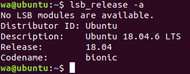
+ 网络环境：输入`ifconfig`得到下面的结果，则服务端ip地址为`192.168.47.133`
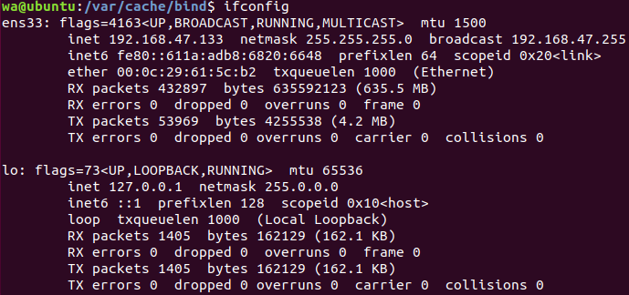


#### 步骤
关闭dnssec-validation服务：
```shell
wa@ubuntu:~$ cd /etc/bind
wa@ubuntu:/etc/bind$ code named.conf.options
```
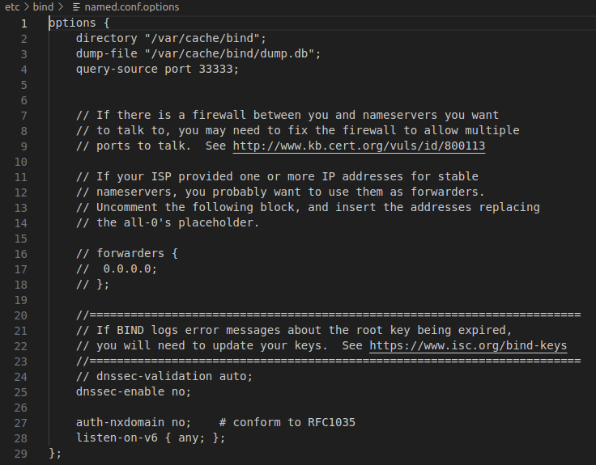

刷新缓存，重启服务器，导出数据：

*导出数据：`rndc dumpd -cache`，会导出至`/var/cache/dump.db`，用VScode打开即可*


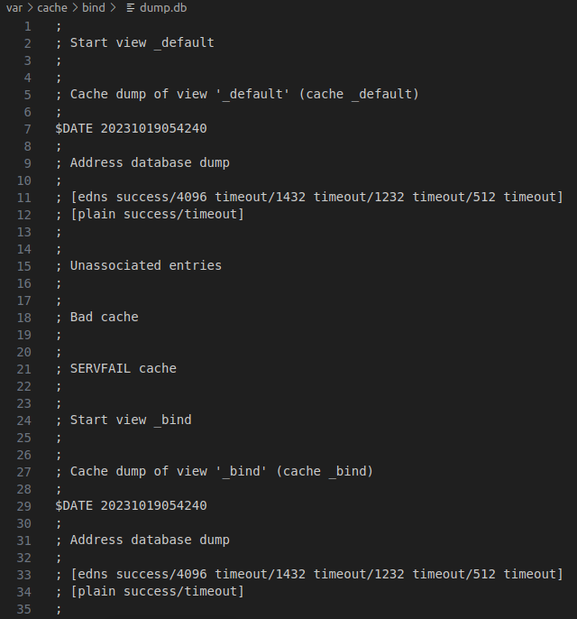

至此，服务端已完成配置

### 配置客户端
#### 环境
自己搭建的虚拟机，操作系统为Ubuntu 22.04.3 LTS

ip地址为`192.168.47.131`

Python版本为`Python 3.10.12`

#### 检查服务端是否运行正常
配置`/etc/resolv.conf`，namesever改为`192.168.47.133`

在客户端输入`dig @192.168.47.133 www.baidu.com`发现DNS解析正常

在客户端用浏览器访问`www.baidu.com`发现能正常浏览

在server端刷新`dump.db`文件，并打开

```shell
wa@ubuntu:~$ sudo rndc dumpdb -cache
wa@ubuntu:~$ code /var/cache/bind/dump.db
```

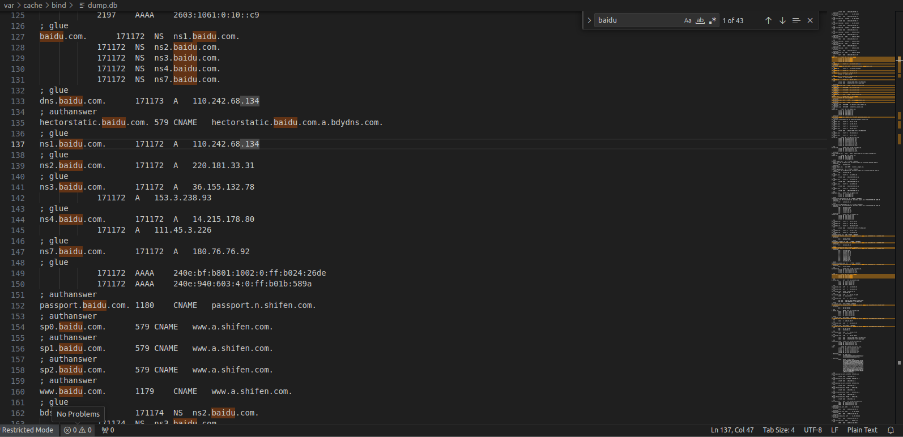

可以看到，查找`baidu`字段，出现了很多相关解析

值得一提的是，我还发现了不少指向azure的网络请求，怀疑是VScode自动发出的，但是我无法找到足够的证据。

### 投毒攻击
在客户端运行`toudu.py`，即可开始自动刷新

在运行一段时间后，成功：
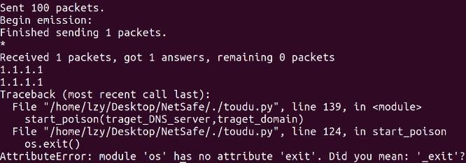

可以看到，成功解析到了`1.1.1.1`。

我们在server端中刷新`dump.db`，打开，查找字符串"1.1.1.1"，即可找到对应的DNS解析记录：

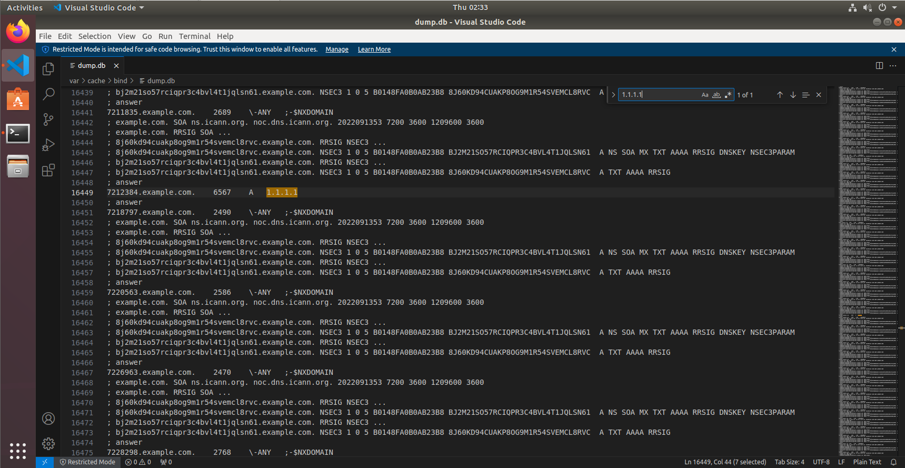

对应的网址是`7212384.example.com`

我们在客户端用浏览器打开这个地址，可以发现：

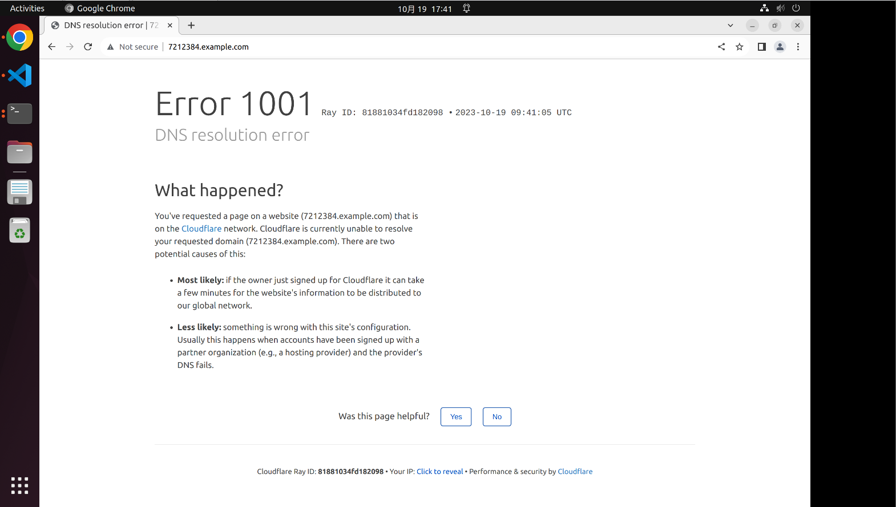

即成功地解析到了Cloudflare(`1.1.1.1`)

通过浏览器的后台，也可以看到成功访问了`1.1.1.1:80`

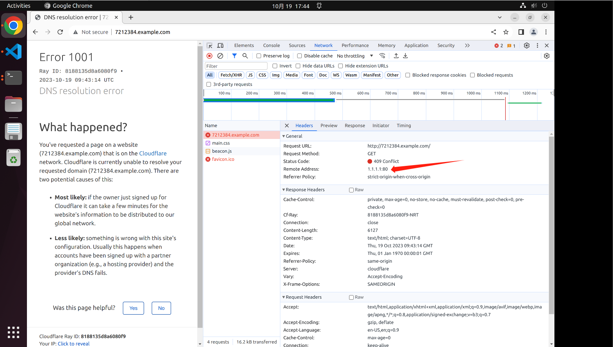

说明我们的攻击成功

## 代码解释
+ `ipv4_addr_check(ipAddr)`：检查所给的IP地址是否有效
+ `Get_target_IP_list(target_server, domain)`：输入要请求的域名，返回最终负责的权威域名服务器列表，用于之后的伪造
+ `fake_q(target_recursive_dns_ip, domain)`：用于发送伪造的DNS查询请求。它构建一个DNS查询数据包，将请求发送到指定的递归DNS服务器以请求特定域名的IPv4地址。
+ `DNS_QR(target_server, qd)`：发送DNS查询请求到指定的DNS服务器，用于检测攻击是否成功
+ `DNS_sending(target_server, domain, iplist, times)`：用于发送DNS响应数据包。它会伪装成DNS权威域名服务器，发送大量伪造的DNS响应数据包到指定的DNS服务器
+ `start_poison(target_DNS_server, target_domain)` 函数：这个函数是主要的攻击逻辑。它首先获取目标域名的上级权威DNS服务器的IP地址列表，然后不断尝试执行以下操作：
   - 生成随机的域名rand_domain
   - 向受害DNS服务器发送伪造的DNS查询请求，查找rand_domain的DNS地址
   - 伪装成权威域名服务器，发送大量伪造的DNS响应数据包，试图欺骗服务端
   - 尝试获取解析结果，如果解析结果为"1.1.1.1"，则说明攻击成功，退出攻击。

综上，这个程序每次随机生成一个"*.example.com"域名，向服务端发起请求，同时再伪装成权威域名服务器向服务端发送大量伪造数据包，再检测攻击是否成功。

## 问题与困难
**1.在客户端访问网址后，服务端的dump.db无更改**

解决方式：每次访问`dump.db`前，需要刷新
```shell
wa@ubuntu:~$ sudo rndc dumpdb -cache
```
**2.python导入scapy包失败**

在`pip`导入`scapy`包之后，还是无法找到该模块。

最后发现`pip`把模块默认安装在`/home/lzy/.local/lib/python3.10/site-packages (2.5.0)`中，而python的搜索路径中没有这个路径

解决方式：强制指定`pip`的安装路径，安装在`/usr/lib/python3.10`下
```shell
lzy@ubG22:/usr/lib/python3.10$ sudo pip install --target . scapy
```
**3.Markdown渲染器在导出pdf文件时，排版混乱**
解决方式：在[Github](https://github.com/KnownCircle/Network-Security/blob/main/%E5%AE%9E%E9%AA%8C1/%E6%8A%A5%E5%91%8A.md)上传`.md`文件，易于阅读
